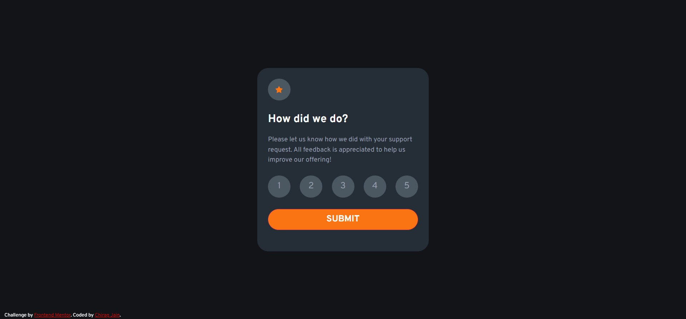

# Frontend Mentor - Interactive rating component solution

This is a solution to the [Interactive rating component challenge on Frontend Mentor](https://www.frontendmentor.io/challenges/interactive-rating-component-koxpeBUmI).
## Table of contents

- [Overview](#overview)
  - [The challenge](#the-challenge)
  - [Screenshot](#screenshot)
  - [Links](#links)
- [My process](#my-process)
  - [Built with](#built-with)
  - [What I learned](#what-i-learned)
  - [Continued development](#continued-development)
  - [Useful resources](#useful-resources)
- [Author](#author)
- [Acknowledgments](#acknowledgments)

## Overview

### The challenge

Users should be able to:

- View the optimal layout for the app depending on their device's screen size
- See hover states for all interactive elements on the page
- Select and submit a number rating
- See the "Thank you" card state after submitting a rating

### Screenshot

- Solution URL: [Add solution URL here](https://your-solution-url.com)
- Live Site URL: [Add live site URL here](https://your-live-site-url.com)

## My process

### Built with

- Semantic HTML5 markup
- CSS custom properties
- Flexbox
- CSS Grid
- Mobile-first workflow
- Bootstrap

### What I learned

Use this section to recap over some of your major learnings while working through this project. Writing these out and providing code samples of areas you want to highlight is a great way to reinforce your own knowledge.

The major challenges I faced during this project was figuring out how the user would select and submit rating. 
First I thought of using a checkbox or radio input type inside a form but that would require a server to handle the form data which was not recommended in this project and also make the project very complex. 
But I was thinking completely wrong, as this could done by adding event listeners which I had figured out and hence used it in the project.

### Useful resources

- (https://developer.mozilla.org/en-US/) 
- (https://www.geeksforgeeks.org/)

## Author

- Website - [CHIRAG JAIN](https://github.com/ChiragJain7300)
- Frontend Mentor - [@ChiragJain7300](https://www.frontendmentor.io/profile/ChiragJain7300)
